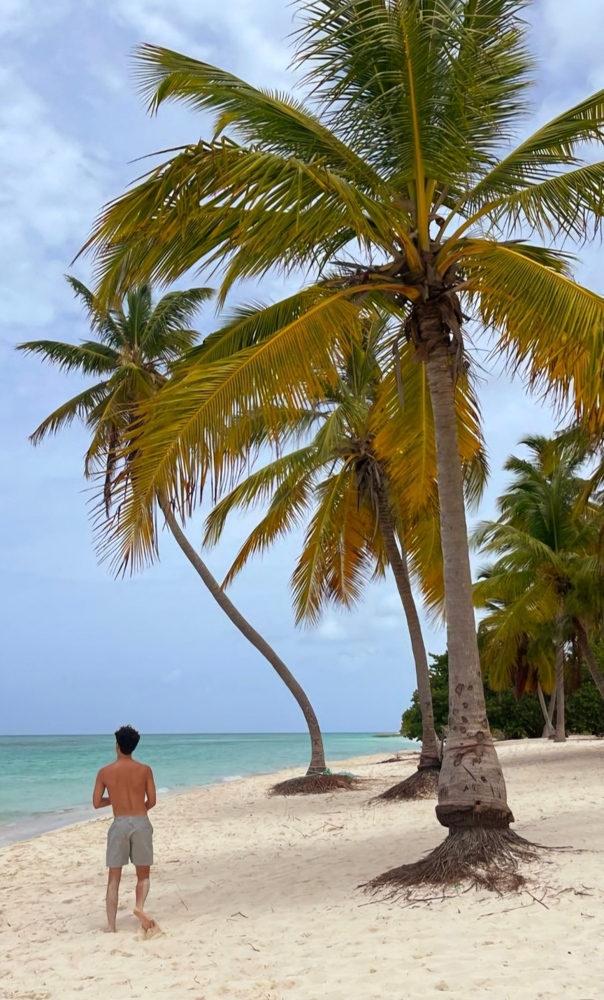

# My Life

**Introduction:**

Samuel Blondeau 

12th Grade

17 years Old (11/20/2006)

Chatsworth Charter Highschool

**Summer Travel Experiences|**
Over the Summer I went to the Dominican Republic. Throughout my vacation I saw many beautiful beaches and ate amazing food in those 2 weeks!

**Sports|**
I play many sports including Golf and Pole Vaulting

**Favorite Food|**
I can't choose just one! I have so many favorites including, sushi, orange chicken, steak, fried chicken, a variety of fruits, and of course desserts!

 **Favorite Summer Memory with Friends|**
My favorite summer memory with my freinds would be going to all the beaches that Los Angeles has to offer

**Fun Fact About Yourself|**
One cool fact about me is that I speak another language. Both my parents are European, my dad was born in France and my mom was born in Belgium. When I was born my frist word was "papillon" which means Butterfly! I now can fluently speak French and English

